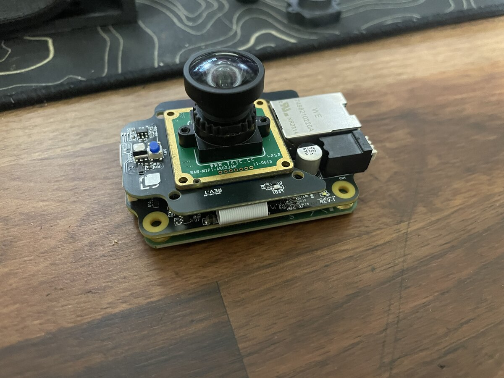
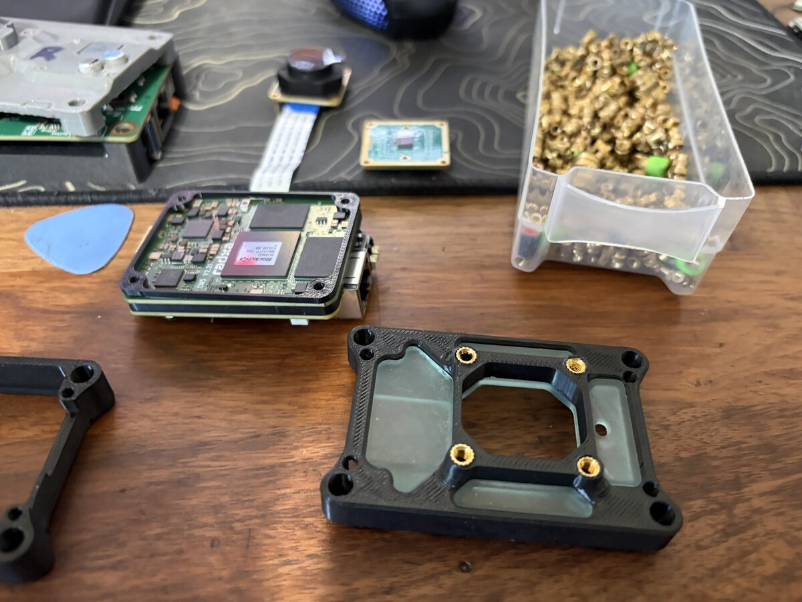
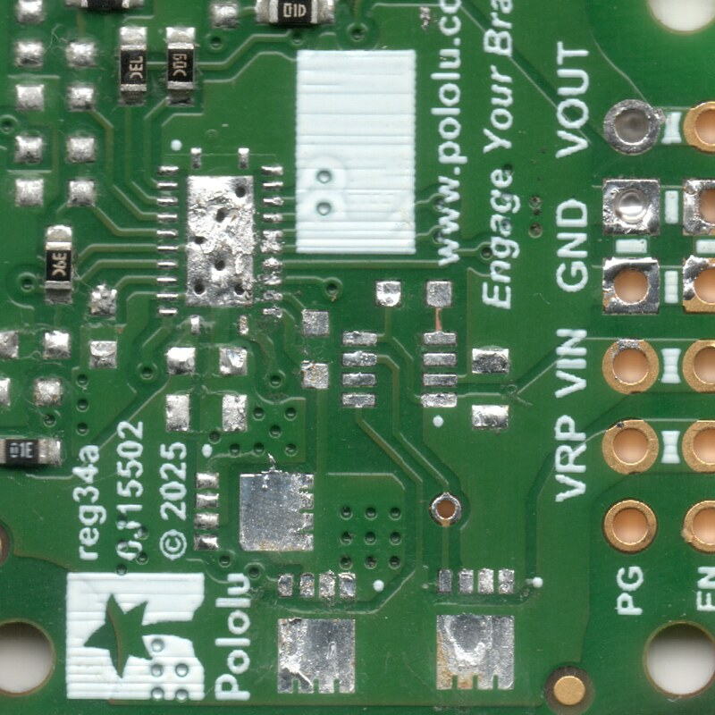
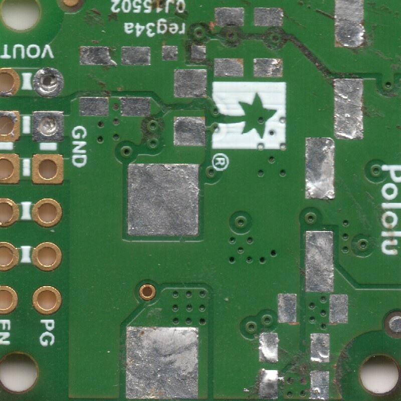
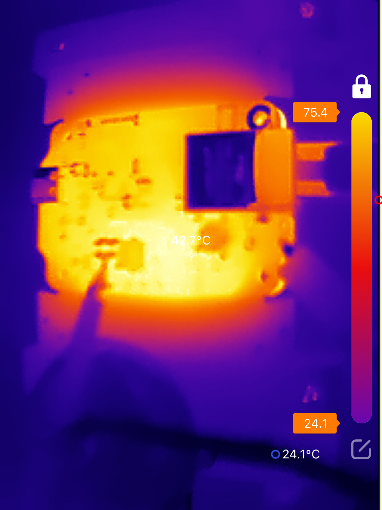
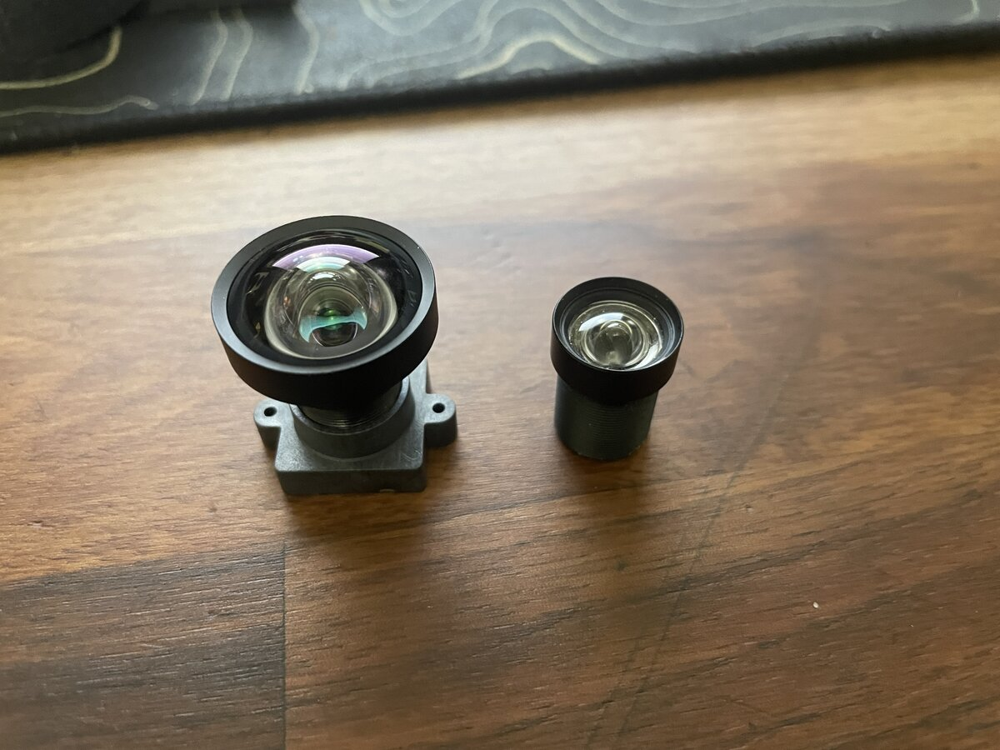
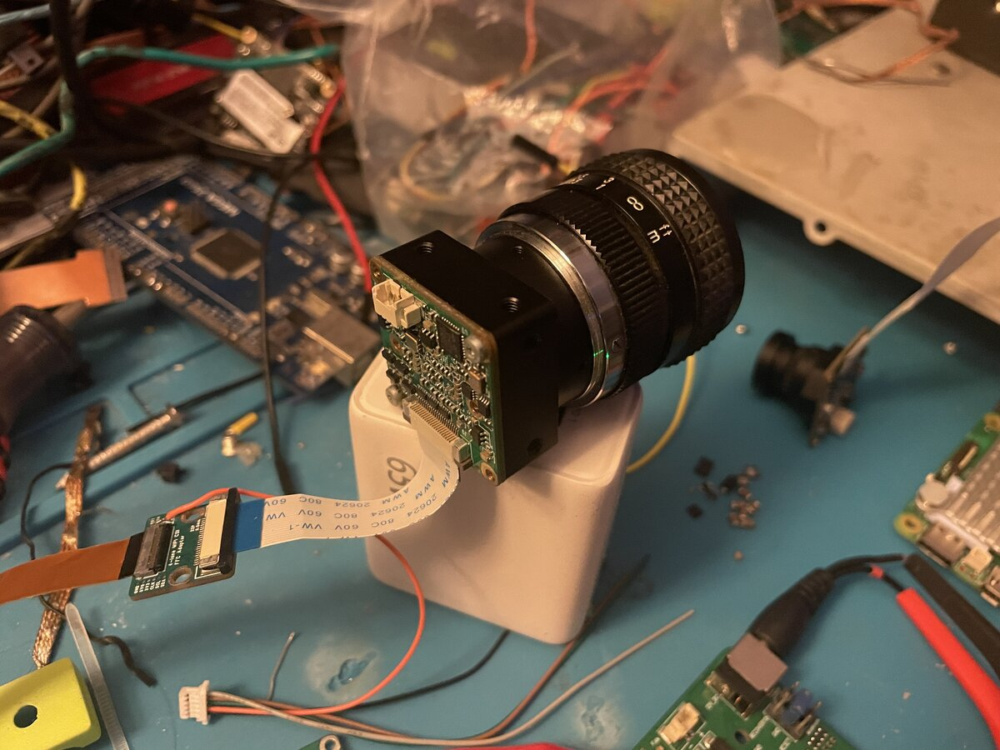
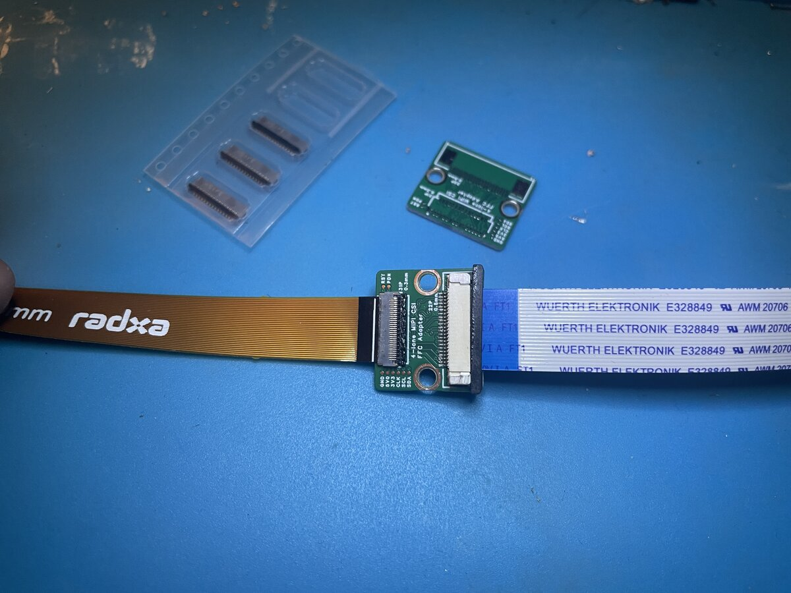
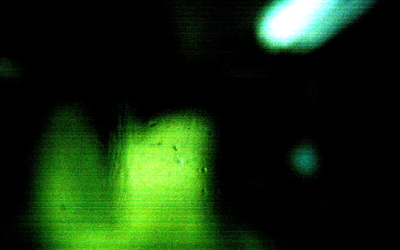

v1 took the v0 proof of concept and made it more practical and performant.

## Main Changes:

- 4-lane MIPI CSI interface for higher bandwidth between sensor and ISP
- Color sensor option with pixel binning
- Improved M12 lenses (lower distortion, wider aperature) option for CS lenses
- Beefier buck converter with a wider voltage input range, 
- Better transient voltage spike protection, reverse polarity protection, power input ORing (ideal diode)
- External frame trigger support for potential stereoscopic vision or multi-cam pnp 
- IMU support on a daughterboard
- USB type-c 3.1 for external TPUs and cameras
- Much smaller footprint

<figure>

<figcaption>smaller than a limelight 4</figcaption>
</figure>

---

Lots of iteration went into determining the smallest possible size (ultimately limited by the size of the compute module and lenses). While originally the cases were planned to be machined out of 6061 alumnium, tarrifs led to the intial cases being 3d printed out of though-resin and PC filament.

---

<figure>

<figcaption>power ORing ideal diode schematic</figcaption>
</figure>

Two ideal diode circuits provide both reverse polarity protection but dual power input capability without back feeding power.

---

## Power Design:

<figure>

<figcaption>reverse engineering of the pololu design</figcaption>
</figure>

A sacrificial Pololu module was then desoldered, imaged, components measured, then a schematic was created for it to compare against.

A choice was made to go with the same TI LM5148 chip found in the pololu design for its proven reliability in FRC, its wide voltage input range and high efficiency.

I once again used TI's Webench online calcultor, this time much more aware of factors such as phase margin, loop compensation, and going for a slightly higher switching frequency than the Pololu design given constrained board space.

Compared to v0, v1's buck converter is capable of supplying 2x the current nominally with surges even higher, combined with the much larger input, output bulk capacitors, lots of decoupling capacitors, a properly specced TVS diode, and more foresight meant that v1's buck converter was far more reliable (although not perfect).

---

<figure>

<figcaption>buck converter thermal testing at 48 volts (gets quite hot), this is an extreme scenario</figcaption>
</figure>

Better lenses were chosen through the following criteria:

- For a given objective (ex. Detect Apriltags from 3 meters with a 120 degree horizontal FOV) minimize FOV while still accomplishhing the objective practically. Its easier to scale by adding more cameras than trying to do more with one camera. - Wider cameras generally suffer from worse lens distortion, additionally the more pixels per tag, the higher the accuracy (ties into sensor resolution).
- Calculate focal-length based off FOV and sensor size
- Minimize lens rated distortion (typically only valuble as a relative measurment) from the manufacturer (if none is given, disregard the lens) - the closer to an ideal "pinhole" model lens accheivable, the less error in the final PnP transformation even given calibration.
- Maximize aperature and sensor format size - lets in more light, reduces chromatic aberation and vingetting. Ex. a 1/1.8" format lens will more than cover a 1/2.7" sized sensor, vise-versa leads to vingetting or only a circle being visible.
- Maximize lens sharpness (usually rated in MP) - related to aberation and the minimum detail the lens can resolve.

[Lens spreadsheet](https://docs.google.com/spreadsheets/d/1u630GVBYNE3ZKmaPmopu_Rl8Lo5_USParXQGhgIc5QA/edit?gid=1428889757#gid=1428889757)

<figure>

<figcaption>new lens (left) vs. old lens (left); same focal length, lower distortion and faster</figcaption>
</figure>

---

<figure>

<figcaption></figcaption>
</figure>

CS lenses were also tested for their even larger aperatures however the availablity, weight and typically much higher focal-lengths made them impractical.

<figure>

<figcaption></figcaption>
</figure>
<figure>

<figcaption></figcaption>
</figure>

---

<figure>

<figcaption>assembled 4-lane test adapter</figcaption>
</figure>

---

<figure>

<figcaption>first color image out of the ISP pipeline (out of focus)</figcaption>
</figure>

<figure>

<figcaption>early ISP debayering debugging</figcaption>
</figure>

## Related

- [FIRST robotics](/projects/02-first/)