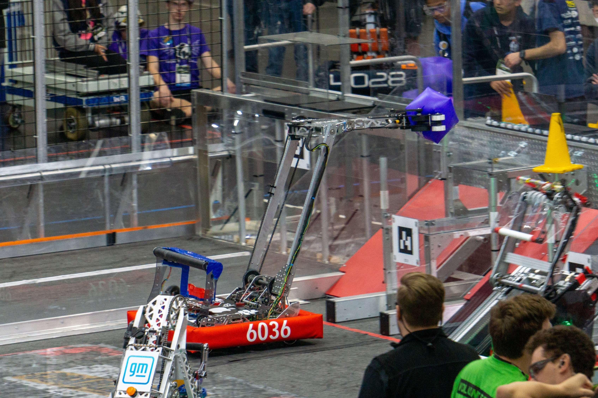
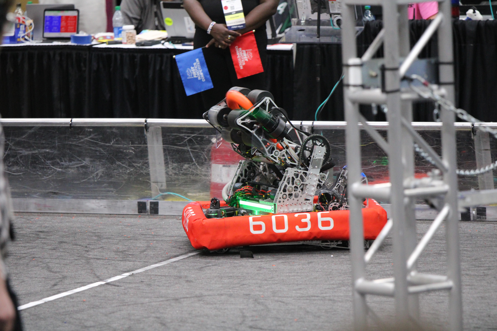
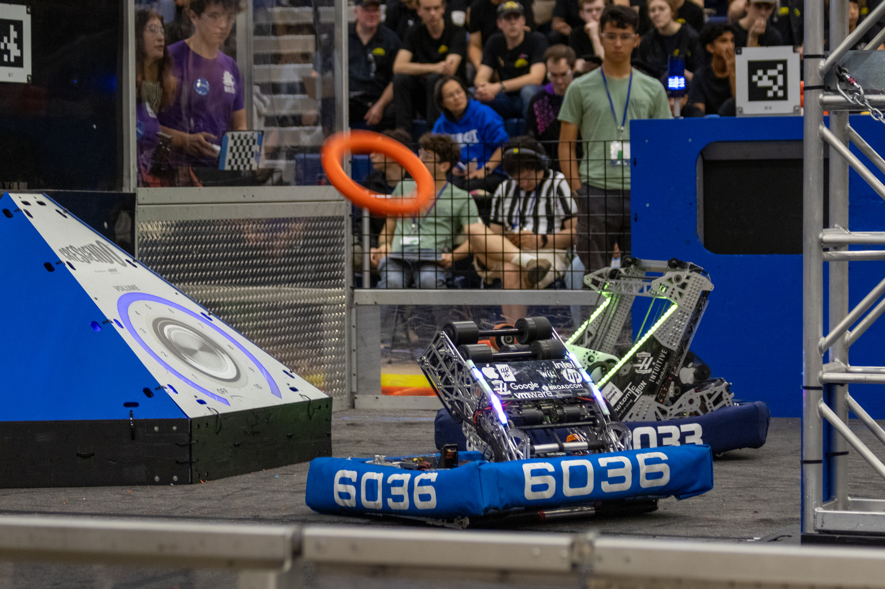
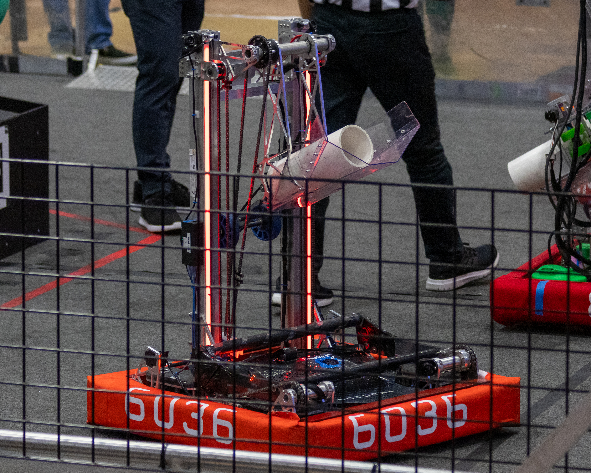
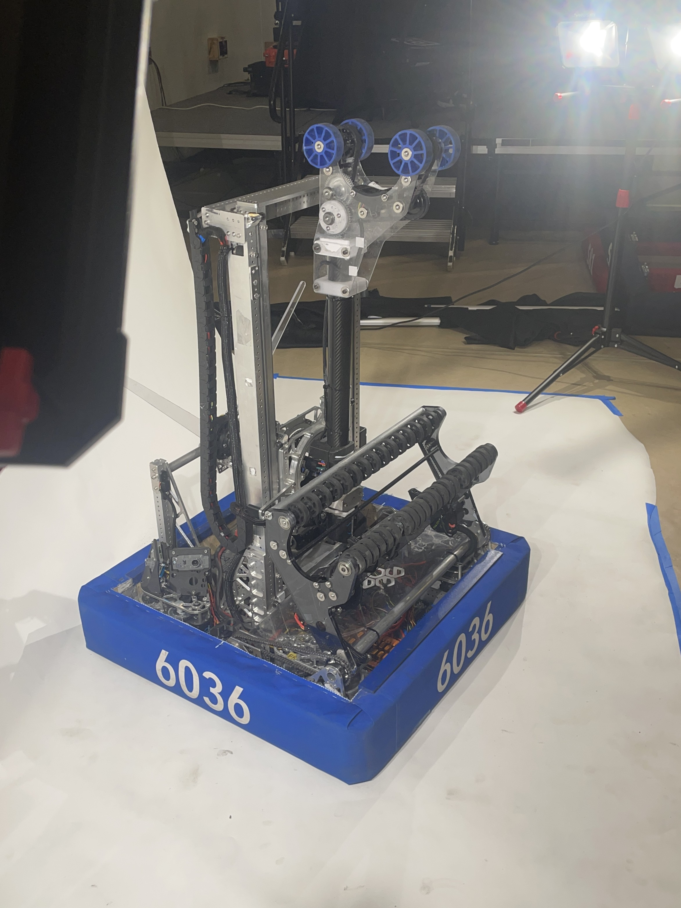
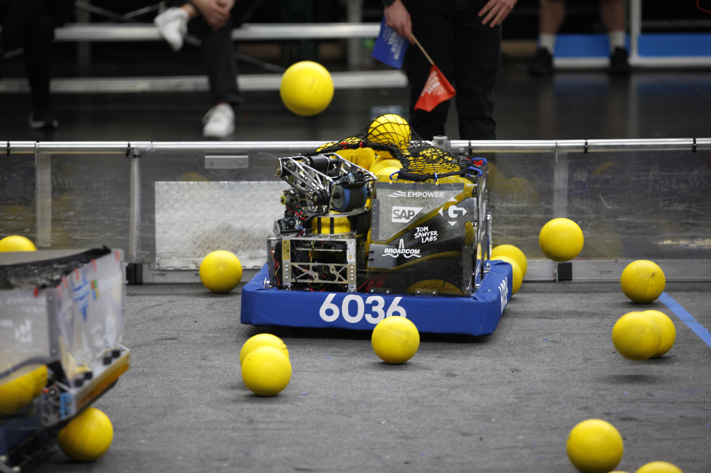

<figure id="chezy-video">
<video src="./chezy.mp4" autoplay loop muted playsinline disablepictureinpicture style="width: min(800px, 100%); display: block;"></video>
<figcaption>our 2025 offseason robot competing at Chezy Champs</figcaption>
</figure>

As part of the [FIRST](https://en.wikipedia.org/wiki/FIRST_Robotics_Competition) robotics competition, I worked in a team and/or led the design of several robots each in 3 months under a changing set of standardized global rules to complete different tasks.

---

## 2023 Robot
For the game Charged Up, robots would pick up cones and inflated balls and place them in a grid using different arms, elevators, and grippers.

- Designed weight reduced pocketed aluminium plates
- Electronics cover and assorted minor 3d prints

---

## 2024 Robot
For the game Crescendo, robots would pick up and shoot foam discs into a goal.

- Designed the chassis and all the electronics mounting
- Designed 4 camera mounts for ~240 degree FOV
- Designed all 3d printed components
- Performed all CAN bus wiring and reliability validation
- Developed basic object detection camera hardware

---

## 2024 Offseason Robot
Same Crescendo game, a simpler (non-turreted), lighter, faster, robot with key improvements

- Led design and electronics subteams
- Designed chassis, shooter, pivot, intake, indexer
- Designed all 3d printed components
- Designed and built the complete CAN bus wiring harness, implementing a redesigned topology and switching to Molex SL for better reliability and debuggability

The intake, shooter, and wiring were the key areas improved over the on-season robot, implementing *lots* of prototype iteration and lessons learned throughout the season. We carried this improved electronics system into future robot designs.

---

## 2025 Robot
Reefscape revolved around picking and placing 4.5" PVC pipe segments onto pegs and removing inflated balls into a net. Finally robots had to latch on to a low handing steel cage and lift themselves off the ground.

- Led design and electronics subteams
- Designed the single-stage elevator, pivot, end effector, funnel, intake/climber, chassis
- Designed camera mounts
- Designed all 3d printed components
- Designed and built the complete CAN bus wiring harness
- Did not iterate nearly enough..

While reliable, this robot archetype had a few key shortcomings that ended up costing us all of which were driven by a lack of sufficient prototyping.

---

## [2025 Offseason Robot](#chezy-video)
Same game, a completely different (exceptionally complex) robot archetype — development took far longer, but the end result was the most technically ambitious robot we had built.

- Led design and electronics subteams
- Delegated most of the design
- Designed slip-ring based pivot
- Designed intake and 2-stage elevator

This robot had far more collaboration as a result of the complexity demanded, software tuning and drive practice time were ultimately very short. Although the robot itself never reached its full potential, we maximized the lessons learned — especially around design scope, delegation, and time management.

---

## 2026 Robot
In Rebuilt, robots intake and shoot as high a volume of foam balls into a goal. A steel tower can then be climed on for extra points but was ultimately strategically useless. Throughput is key.

- Led electronics subteam and [vision hardware development](/projects/01-lux/)
- Developed 3d-printed compact energy-chain cable carrier for the robot turret
- Prototyped and iterated an L3 climber (deprioritized due to time constraints)
- Designed eight camera mounts for 360 degree vision and object detection
- Briefly iterated and abandoned a dye-rotor indexer
- Re-designed chassis electronics mounting layout to allow for higher flexibility, consolidate discrete power distribution PCBs, and reduce the overall footprint.

<figure id="2026 robot">
<video src="./IMG_9944.mp4" controls disablepictureinpicture style="width: min(400px, 50%); display: block;"></video>
<figcaption>gatling gun</figcaption>
</figure>

---

FIRST taught me invaluable lessons about project and time management, how to be a good leader, executing reliably, and working with people — more valuable than any specific technical skill learned.